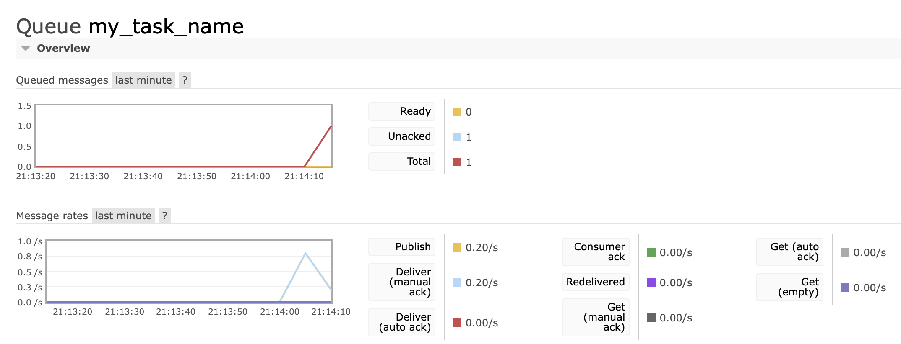

I need to workaround cases, when task is failed in worker, comes back to queue 
fails again, and so on.

I wrote little subclass for 
[aio-pika Master/Worker pattern](https://aio-pika.readthedocs.io/en/latest/patterns.html#master-worker), 
that re-publishes failed message specified number of times (using publish + 
nack requeue=false), and finally rejects message.
 
For some reason it does not work with transactions (message, that has 
failed all given attempts is not rejected, but is still in unacked status).

If i stop worker with such unacked message, message becomes ready. If i start 
worker again, i see message is handled one time and rejected successfully 
(perhaps, because there is no transaction anymore).

Repo demonstrates this strange behaviour. Why does that happen?

```
# run rabbitmq with web admin
docker-compose up -d

# authenticate via guest/guest
open http://localhost:15672/

# create virtual environment and install requirements
python3.8 -m venv env
env/bin/pip install -r requirements.txt

# Test republish without transaction, publisher confirms are used, works fine
env/bin/python worker.py --publisher-confirms
env/bin/python master.py --publisher-confirms

# Test republish using transaction, message stay unacked (problem case)
env/bin/python worker.py
env/bin/python master.py
```


